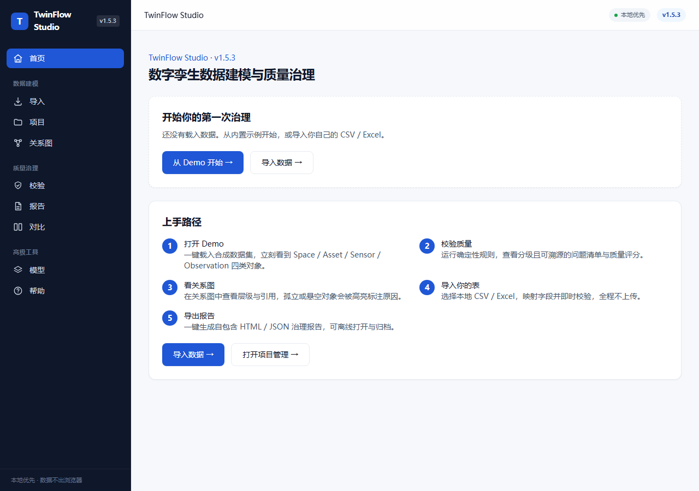
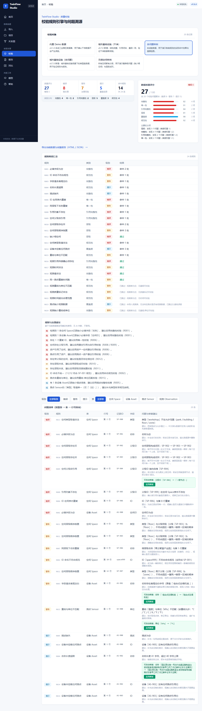
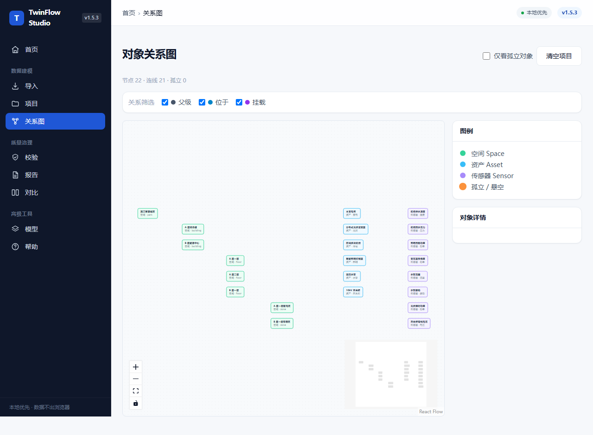
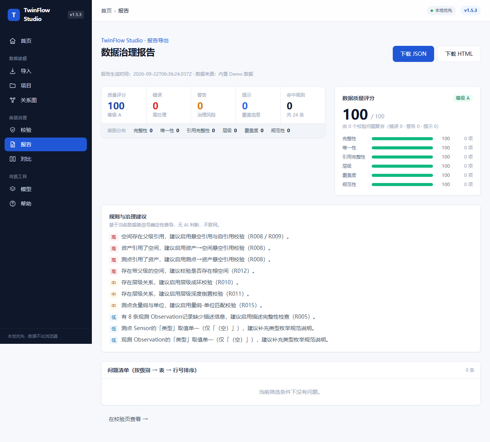
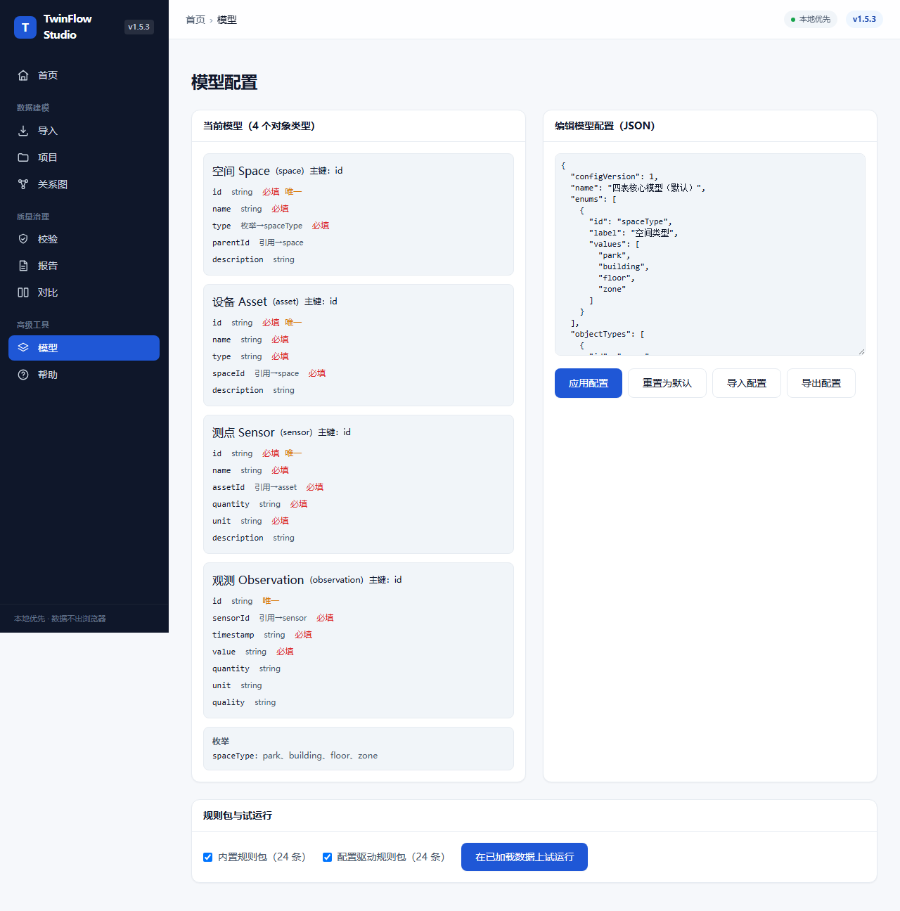
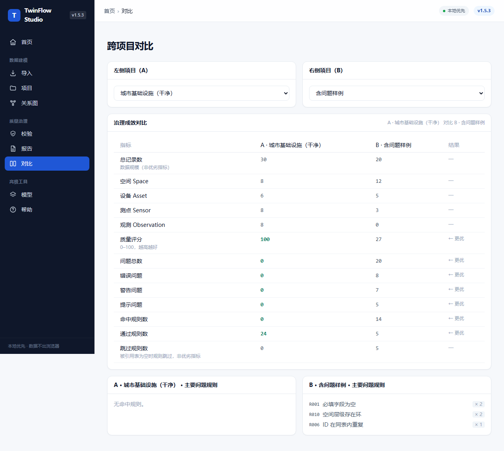

[English](./README.en.md) | **简体中文**

# TwinFlow Studio

[](https://github.com/hunterwalks/twinflow-studio/actions/workflows/ci.yml)
[](https://github.com/hunterwalks/twinflow-studio/releases)
[](./LICENSE)
[](https://nextjs.org/)
[](https://www.typescriptlang.org/)

> Local-first 的数字孪生数据建模与质量治理工作台

TwinFlow Studio 面向数字孪生项目早期阶段，在浏览器本地完成 Excel / CSV 导入、字段映射、四表建模、校验、关系图、修复、报告导出与跨项目对比。无需后端，不依赖 API Key，刷新或重开后自动恢复。

**当前版本：v1.5.3**（版本号唯一来源为 `package.json`；`src/lib/version.ts`、页脚与报告元信息同步维护，避免漂移）

## 适合谁用

| 角色 | 典型问题 | 在本工具里做什么 |
|---|---|---|
| 产品经理 | 这份数据能不能直接进项目？ | 导入表格 → 看质量评分与问题分级 → 判断是否需要先治理 |
| 方案责任人 | 怎么形成可汇报、可交付的治理结论？ | 校验 → 关系图复核 → 导出 HTML / JSON 报告 |
| 开发者 | 想本地跑起来或二次开发？ | `npm ci && npm run dev`，或读 [`CONTRIBUTING`](./.github/CONTRIBUTING.md) |

## 核心能力

- **四表建模**：Space / Asset / Sensor / Observation，用贴近业务对象的方式组织数字孪生资产。
- **本地导入**：浏览器端解析 `.csv` 与 `.xlsx` / `.xls`，支持多工作表切换、字段自动映射与置信度提示。
- **确定性校验**：24 条规则覆盖完整性、唯一性、引用、层级、覆盖度与规范性，输出分级、可定位到行/字段的问题清单。
- **质量评分**：0–100 分 / A–E 等级，按六个维度聚合并定位主要扣分项。
- **修复预览**：对空白、超长、自引用、单位不一致等可安全推断的问题生成 before→after 预览并一键应用。
- **对象关系图**：基于 React Flow 可视化对象层级、引用关系与孤立对象。
- **治理报告**：导出浏览器内自包含的 HTML 与结构化 JSON 报告。
- **跨项目对比**：并排比较当前项目与内置样例的规模、评分、问题分布与高频规则。
- **离线帮助**：内置 `/help` 页，无需联网即可查看快速开始、数据模型与常见问题。

## 快速开始

三种方式任选其一。

### 1. 在线使用（零安装）

1. 打开 [TwinFlow Studio 在线版](https://hunterwalks.github.io/twinflow-studio/)。
2. 点击「从 Demo 开始」载入合成工业园区数据集。
3. 依次体验「校验数据 → 查看关系图 → 导出报告 → 跨项目对比」。

### 2. 免安装离线包（无需 Node.js）

在 [Releases](https://github.com/hunterwalks/twinflow-studio/releases/latest) 下载 web 静态包（文件名形如 `twinflow-studio-v1.5.3-web.zip`），解压后用任意静态服务器打开即可：全程不联网、不上传数据。

### 3. 源码运行（二次开发）

要求：Node.js ≥ 18.18（推荐 20+），npm ≥ 9。

```bash
git clone https://github.com/hunterwalks/twinflow-studio.git
cd twinflow-studio
npm ci
npm run dev        # http://localhost:3000
```

常用脚本：

| 命令 | 说明 |
|---|---|
| `npm run dev` | 启动开发服务 |
| `npm run build` | 生产构建（非静态导出） |
| `npm run start` | 启动生产服务（需先 `npm run build`） |
| `npm run typecheck` | TypeScript 类型检查 |
| `npm run lint` | ESLint 检查 |
| `npm run test` | 运行 Vitest 单元测试 |
| `npm run test:e2e` | 运行 Playwright E2E（需先 `npx playwright install chromium`） |

CI 状态见上方徽章。本地一次跑完五道质量门：

```bash
npm run typecheck && npm run lint && npm run test && npm run build && npm run test:e2e
```

## 演示

以下截图由 `scripts/capture-screenshots.mjs` 在本地运行生成（内置合成数据；数据不会离开浏览器）。



| 校验数据 | 对象关系图 |
|---|---|
|  |  |

| 治理报告 | 模型配置 |
|---|---|
|  |  |



## 目录结构

```
twinflow-studio/
├── .github/
│   ├── workflows/        # CI 与 GitHub Pages 部署
│   ├── ISSUE_TEMPLATE/   # Issue 表单
│   ├── CONTRIBUTING.md   # 贡献指南（含 AI 辅助贡献政策）
│   ├── SECURITY.md       # 安全策略与漏洞上报方式
│   ├── CODE_OF_CONDUCT.md
│   └── pull_request_template.md
├── src/
│   ├── app/              # Next.js App Router
│   ├── components/       # UI 组件
│   ├── lib/              # 规则引擎、导入、报告、项目、关系图、质量评分等
│   └── test/             # Vitest 单元测试
├── e2e/                  # Playwright 端到端测试
├── scripts/              # 构建/截图辅助脚本
├── screenshots/          # README 演示截图
├── README.md             # 中文说明（默认）
├── README.en.md          # English
├── CHANGELOG.md          # 完整版本历史
├── PRIVACY.md            # 隐私说明（local-first 边界）
├── ROADMAP.md            # 路线图
└── LICENSE               # MIT
```

## 隐私与本地处理

- 所有数据在浏览器本地处理：CSV / XLSX 解析、字段映射、校验、关系图、修复与报告导出均不上传业务后端。
- 核心引擎为确定性纯函数，无需配置任何 API Key 即可完整使用。
- 当前数据集自动写入浏览器 `localStorage`（键 `twinflow-project-v1`），刷新或重开后自动恢复。可在「关系图」页点击「清空项目」，或清除浏览器站点数据。
- localStorage 不可用时顶部会出现提示，应用仍可运行，但刷新后不会恢复。
- 详见 [PRIVACY.md](./PRIVACY.md) 与 [安全策略](./.github/SECURITY.md)。

## 贡献

欢迎提交 Issue、Pull Request 或参与讨论。开发流程、AI/GPT 辅助政策与质量门详见 [CONTRIBUTING.md](./.github/CONTRIBUTING.md)；参与前请阅读[行为准则](./.github/CODE_OF_CONDUCT.md)。安全漏洞请按[安全策略](./.github/SECURITY.md)私密上报，不要开公开 Issue。

## 版本历史

完整变更记录见 [CHANGELOG.md](./CHANGELOG.md)。

## 许可

[MIT](./LICENSE)
