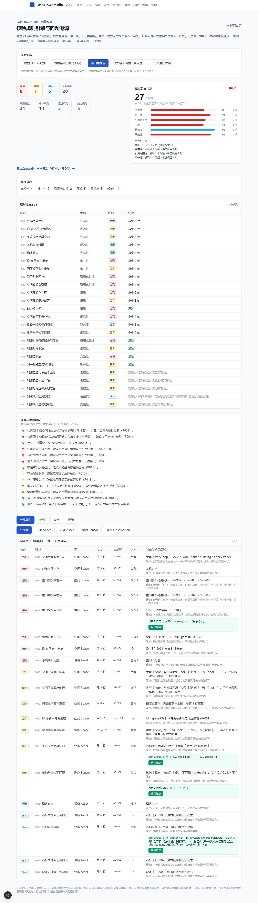
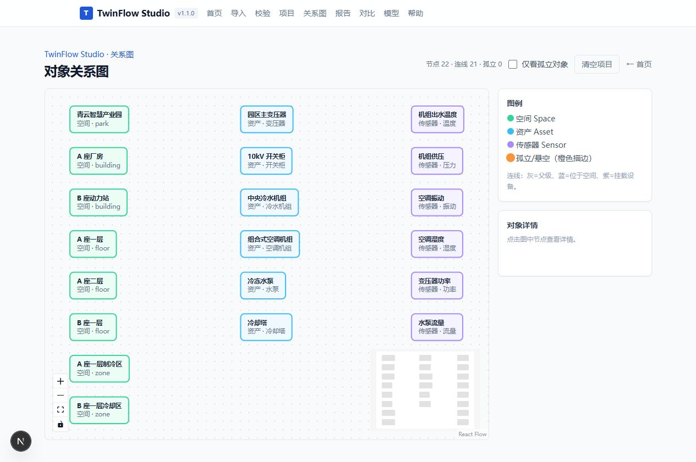
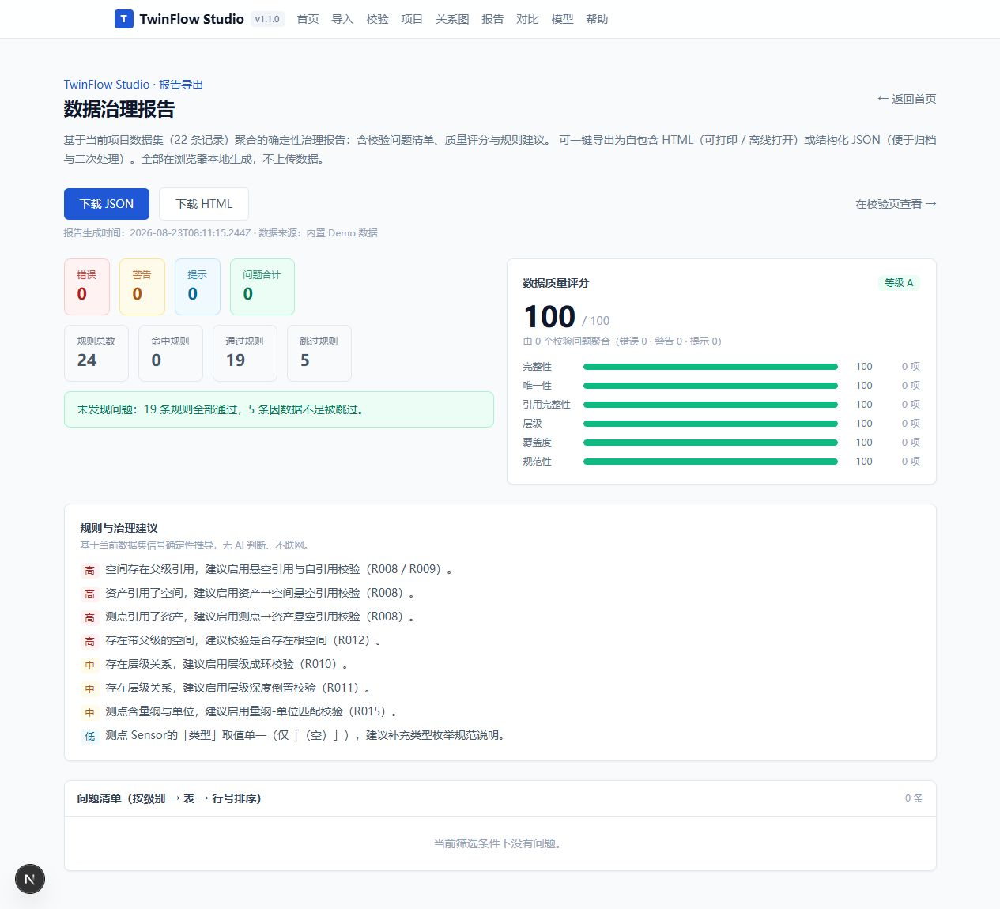
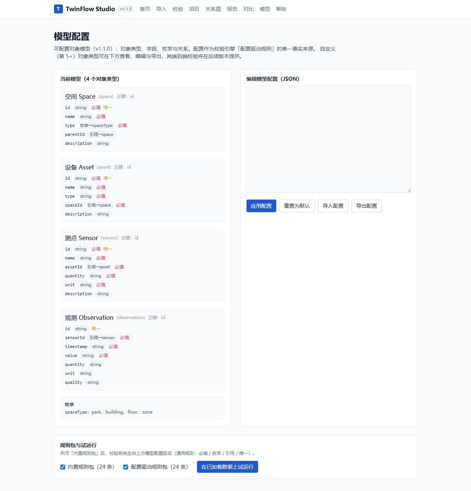
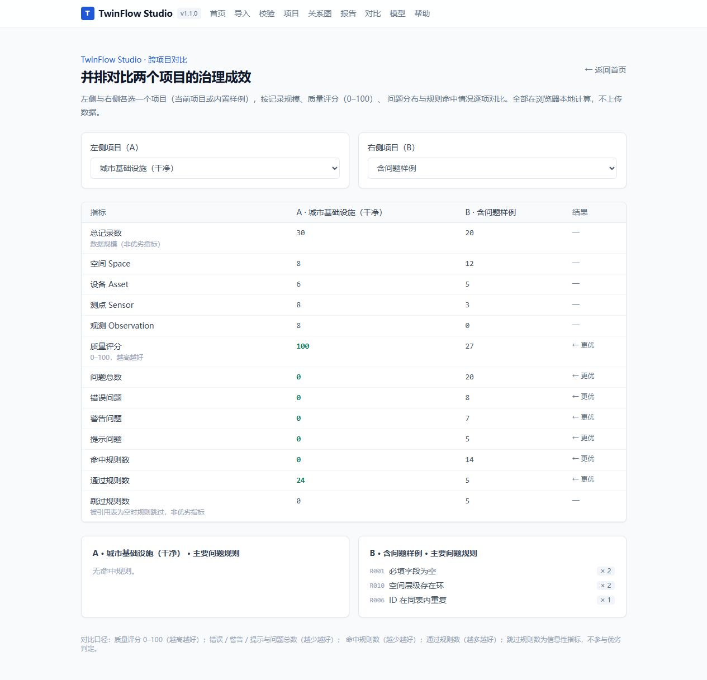

# TwinFlow Studio

> Local-first、AI-assisted 的数字孪生数据建模与质量治理工作台

TwinFlow Studio 面向数字孪生产品、解决方案、实施和数据人员，帮助在项目早期从 Excel / CSV 资产资料中识别业务对象、建立空间与设备关系、检查数据质量并形成可追溯治理报告。

**当前版本：v1.2.0（关系图专项优化 + 多表批量导入：关系图按 Space 深度展开布局、边方向统一为父→子、节点点击详情、连线可见性与关系筛选、多表批量导入向导、导航栏 testid 去重；并继承 v1.1.0 的可配置模型与规则、24 条确定性规则、一键修复、跨项目对比、大表虚拟滚动、分块校验、离线帮助）**

- 本仓库已落地 v0.1.0–v1.2.0；标准交换、CLI/CI、可插拔 AI 等能力见 Roadmap，未提前实现

## v0.1.0 能力范围

- 应用骨架（Next.js + TypeScript + Tailwind CSS）
- 内置「合成工业园区」Demo 数据（Space / Asset / Sensor 三类对象）
- 对象数量概览与工作表式数据预览
- 空状态与错误状态的可理解提示
- Vitest 单元测试底座（schema 校验、数据完整性、状态机、列推导）
- 确定性校验与 Local-first 设计：无 AI、无后端、无外部依赖仍可运行

## v0.2.0 新增：CSV / XLSX 导入

- 浏览器端选择并导入 `.csv` 与 `.xlsx` / `.xls` 文件，**不落盘、不联网**
- Excel 多工作表列举与切换选择
- 字段映射：将源列映射到 Space / Asset / Sensor 的模型字段，并按表头给出智能默认映射
- 确认后按现有 Zod 模型逐行校验，给出通过计数与带行号的中文错误（如「第 3 行：ID不能为空」）
- 对不支持的格式、空文件、无法解析的文件给出明确中文提示
- 新增依赖：`papaparse`（CSV）、`xlsx`（SheetJS，XLSX）；均为浏览器端库

## v0.3.0 新增：确定性校验规则引擎

- **15 条规则**，覆盖 6 个类别：完整性、唯一性、引用完整性、层级、覆盖度、规范性
- **问题分级**：错误（数据不可用）/ 警告（可用但有治理风险）/ 提示（完整度与覆盖度信息）
- **问题可溯源**：每条问题定位到 表 / 行号 / 记录 ID / 字段，并给出中文描述与修复建议
- **确定性输出**：排序键固定为 级别 → 表 → 行号 → 规则 ID → 字段，同一输入必然同输出
- **假阳性防护**：被引用表为空时，跨表引用类规则自动跳过并标注原因，不产生悬空引用误报
- **纯函数、无 AI、无网络、无持久化**：直接作用于 v0.2.0 导入产物这样的宽松数据集
- 新增 `/validate` 页面：切换「内置 Demo / 含问题样例 / 无根空间样例」，查看分级汇总、规则维度汇总与可筛选问题清单
- `/import` 页面在字段映射校验后追加规则引擎结果区块（并说明跨表规则被跳过）

## v0.4.0 新增：对象关系图、孤立对象与项目保存恢复

- **对象关系图**：基于 React Flow（`@xyflow/react`）在 `/graph` 页面可视化 Space / Asset / Sensor 的层级与引用结构；节点按类型配色、可缩放 / 拖拽 / fit view，点击查看对象详情
- **确定性布局与连线**：按类型分列的稳定布局，生成「父级 / 位于空间 / 挂载设备」三类关系连线
- **孤立 / 悬空对象识别**：高亮悬空引用与层级不可达对象并标注中文原因；被引用表为空时跳过跨表判定，不产生误报
- **项目保存与恢复**：当前数据（Demo 或导入结果）自动写入浏览器 `localStorage`，关闭重开自动恢复；提供「清空项目」入口
- `/demo`、`/import` 在产出数据后写入统一项目状态，`/graph` 可直接读取；首页新增「查看关系图 →」入口

## v0.5.0 新增：确定性映射建议、质量评分与规则建议

> 路线图中的「AI 映射 / 规则建议」以 **local-first、可离线、可测试** 的确定性方式落地，不引入外部 AI 依赖。

- **确定性字段映射建议**（导入页）：在表头别名精确匹配之外，按 **置信度打分** 给出映射建议，匹配方式分 **精确 / 归一 / 模糊** 三档（基于归一化 + Levenshtein 相似度）；高置信自动映射，低置信标记「需复核」，并展示「高 / 中 / 低」置信度摘要。
- **数据质量评分**（校验页与导入页）：将校验报告聚合成 **0–100 总分 + 等级 A–E**，并按 6 个维度（完整性 / 唯一性 / 引用 / 层级 / 覆盖 / 规范）给出维度分与主要扣分项，可解释、可溯源。
- **规则 / 治理建议**（校验页与导入页）：扫描数据集信号，推荐应启用的内置规则（R001/R002/R005/R006/R008/R010–R012/R014/R015 等）与自定义治理建议（如类型取值单一）；按 高 / 中 / 低 优先级排序，每条给出中文原因。
- 新增 `src/lib/import/similarity.ts`（相似度工具）、`src/lib/quality/score.ts`（质量评分）、`src/lib/quality/recommend.ts`（规则建议）；导入页映射表新增置信度徽标，校验页与导入页新增质量评分与建议卡片。

## v0.6.0 新增：数据治理报告导出（HTML / JSON）

> 路线图 v0.1–v0.6 的收官能力，延续 local-first、可离线、纯确定性设计。

- **报告聚合**（`src/lib/report/build.ts`）：由当前数据集一次性聚合出校验报告 + 质量评分（0–100 / 等级 A–E）+ 规则与治理建议，复用 v0.3–v0.5 的既有引擎，与页面展示完全一致；纯函数、确定性、可测试。
- **HTML 导出**（`src/lib/report/exporters.ts`）：生成**自包含** HTML（内联样式、可打印、可离线双击打开），含质量评分、校验汇总、问题清单（级别 / 表 / 定位 / 字段 / 描述 / 修复建议）与规则建议；所有动态文本均经 HTML 转义，避免注入。
- **JSON 导出**：结构化 JSON（key 顺序固定、确定可复现），便于归档与二次处理。
- **`/report` 页面**：从统一项目状态读取当前数据，预览报告并提供「下载 JSON / 下载 HTML」按钮；空态提示先载入示例或导入数据。校验页也提供「导出当前数据为完整报告 →」入口。
- 浏览器端 `Blob` 下载（`src/lib/report/download.ts`），不依赖后端、不上传数据。

> 报告导出为路线图终点；后续可在此之上扩展更多治理动作（如问题批量修复建议、跨版本对比等），但已不在 v0.1–v0.6 范围内。

## v0.7.0 新增：公开 Beta 与可用性基线

> 把 v0.6.0 从「构建与单测通过」提升为「普通用户可直接访问、能按引导完成一次完整 Demo、失败后知道如何恢复」的 Beta。不新增数字孪生业务范围。

- **公开静态托管（GitHub Pages）**：支持静态导出（`EXPORT=true` + `BASE_PATH` 由 `next.config.mjs` 条件式开启），产物为 `out/`；新增 `.github/workflows/deploy.yml` 自动部署到 GitHub Pages，**local-first 不变**（CSV/XLSX 仍在浏览器内解析，不上传业务后端）。回退方式见部署工作流注释（在 Settings → Pages 切回历史部署）。
- **Playwright E2E**：新增 `.github/workflows/ci.yml` 全量质量门（typecheck / lint / test / build / E2E）；`e2e/flows.spec.ts` 覆盖 9 条主流程（首页开 Demo、Demo 写入项目、校验结果、关系图节点、报告下载、刷新恢复、清空空态、CSV 导入校验、错误/空文件提示），全部使用 `data-testid` 稳定定位。
- **新手引导 / 隐私 / 错误恢复**：首页新增「5 步上手」与「数据在本地处理」说明；全局 `StorageBanner` 在 localStorage 不可用时给出原因与恢复动作；导入/图/报告等页面的空态与错误态给出明确原因与下一步动作。
- **两套城市基础设施合成数据**：新增「城市基础设施（干净）」与「城市基础设施（含问题）」，与既有工业园区数据统一收口到 `src/lib/data/registry.ts`，Demo / 校验页 / E2E 共用；干净基线用于确认无规则误报。
- **ESLint CLI 迁移**：从 `.eslintrc.json`（legacy）迁移到 `eslint.config.mjs`（FlatCompat extends `next/core-web-vitals` + `next/typescript`），消除 `next lint` 弃用警告；`lint` 脚本改为 `ESLINT_USE_FLAT_CONFIG=true eslint .`。
- **新增依赖**：`@eslint/eslintrc`（ESLint Flat Config 兼容）、`@playwright/test`（E2E，浏览器端）。

## v0.8.0 新增：用完整项目而非单张表工作

> 路线图阶段 A 的核心能力：把 v0.7.0 的「单表导入 / 单数据集校验」提升为「以四表项目为单位的建模、保存、迁移与复用」。不引入 AI / 后端，复用既有校验、质量、报告与导入引擎。

- **四表项目模型（Space / Asset / Sensor / Observation）**：在既有三表之上新增 **Observation（观测）** 表，承载测点的时序观测值（`sensorId` + `timestamp` + `value` + 可选 `quantity` / `unit` / `quality`）；统一项目状态 `ProjectState` 升至 **v2**，`localStorage` 键保持 `twinflow-project-v1`，通过 `version` 字段区分。
- **项目 JSON 导入 / 导出**（`src/lib/project/io.ts` + `/project` 页面）：将整个项目（四表 + 元数据）导出为确定性的 JSON 文件，再导入时**整体覆盖**当前项目并持久化；浏览器端 `Blob` 下载，不联网、不上传。
- **导入映射模板复用**（`src/lib/import/templates.ts`）：在 `/import` 页把当前列→字段映射存为命名模板（存 `localStorage` 键 `twinflow-mapping-templates`），下次选同构文件时一键套用、编辑或删除，跨会话可用。
- **v1 → v2 迁移**（`src/lib/project/persist.ts` 的 `migrateProjectV1ToV2`）：旧版三表项目（v1）自动补 `observations: []` 升级为 v2，保留既有空间 / 资产 / 测点，刷新后无缝恢复；非预期结构回退空项目，不抛错。
- **Observation 专属校验规则 R016–R019**（纯函数、确定性、可溯源）：
  - **R016** Observation→Sensor 引用完整性（error，被引用 Sensor 表为空时自动跳过并标注原因，防跨表假阳性）；
  - **R017** 观测时间非法（warning，`Date.parse` 非有限或空）；
  - **R018** 观测值非法（error，`Number` 非有限或空）；
  - **R019** 同测点重复时间戳（warning，按 `sensorId + timestamp` 组合键计数 > 1）。
  - 规则总数由 **15 → 19**。
- **Demo / 校验 / 报告四表贯通**：城市基础设施（干净）数据集补充 8 条合法观测（引用 SE-101~SE-108，零误报基线）；城市基础设施（含问题）数据集补充覆盖 R016–R019 的脏观测；`/demo` 新增 Observation 标签页，`ObjectCounts` 增加观测计数卡，`/validate` 记录数与数据集引入 observations，`/report` 记录数汇总包含观测。
- 版本号升至 v0.8.0；首页、README、CHANGELOG 同步更新。

## v0.9.0 新增：从「能校验」到「能治理」

> 路线图阶段 B：让质量治理闭环可在界面内完成。在 v0.8.0 的四表项目与 19 条规则之上，补齐观测域规则、一键修复与预览、项目元信息与跨表检索、跨项目对比。不引入 AI / 后端，全部为确定性纯函数与本地计算。

- **规则扩展 R020–R024**（规则总数 **19 → 24**）：R020 观测量纲与单位不匹配（warning）、R021 观测质量标记非法（warning）、R022 观测时间戳超出合理范围（warning）、R023 测点无任何观测（info，覆盖度）、R024 观测缺失量纲或单位（warning）。观测表为空时统一跳过并标注原因，不破坏既有样例触发基线。
- **问题修复预览引擎 + /validate 一键修复**（`src/lib/fixes.ts`）：对可确定性修复的问题（R003 去空白 / R004 截断超长名称 / R009 解除父级自引用 / R015·R020 单位归一）渲染「当前值 → 建议值」预览并一键应用；`applyFix` 为不可变更新且应用前校验目标值未被并发改动。不可安全推断目标值的规则仍交用户手动处理。
- **项目元信息（`ProjectState.metadata`）**：name / description / owner 可选字段，`/project` 页编辑保存，随项目 JSON 导出与导入往返恢复。
- **跨表检索**（`src/lib/project/search.ts`）：四表按 ID / 名称模糊查找，`/project` 页提供检索框与结果列表（大小写不敏感、确定性排序）。
- **跨项目对比**（`src/lib/compare.ts` + `/compare` 页）：并排对比当前项目与内置样例的记录规模、质量评分、问题分布与 Top 3 问题规则，数值差异自动标注更优方。
- 版本号升至 v0.9.0；首页、README、CHANGELOG 同步更新；新增 `scripts/build-local.sh` 解决 Windows 本机 `next build` worker 崩溃与清理超时问题（`experimental.cpus: 1` + 覆盖 `NODE_OPTIONS`）。

## v1.0.0 新增：首个稳定可公开推荐版本

> 路线图阶段 A 收官：让陌生用户无需改代码即可稳定走完「导入 → 建模 → 校验 → 修复 → 导出 / 对比」全链路，并明确隐私与数据安全边界。不引入 AI / 后端，全部为确定性纯函数与本地计算。

- **全局导航栏**（`src/components/NavBar.tsx` + `layout.tsx`）：所有页面统一入口，含「帮助」离线页；版本号常驻展示。
- **离线帮助页 `/help`**：内置快速开始、隐私与安全（本地优先 / 无 AI 外发 / 本地存储键名与清空方式）、四表数据模型说明与常见问题（FAQ），完全离线可读。
- **大表虚拟滚动**（`src/components/DataTable.tsx` + `src/lib/table.ts` 的 `visibleRange`）：超过 100 行时仅渲染可视区间行（固定行高窗口化），并增加防御性边界收敛，避免越界输入导致 offsetY 溢出或空渲染。
- **分块校验**（`src/lib/rules/engine.ts` 的 `runRulesInBatches`）：按规则分批执行并合并，结果与 `runRules` 完全等价（确定性）；为后续大表异步分批校验留出统一入口，导入流程已切换接入。
- **示例工作流（案例）**：见下方「示例工作流」一节——从合成工业园区数据集出发，演示「载入 → 校验 → 修复 → 导出报告 → 跨项目对比」的完整治理闭环。

### 示例工作流（案例）

1. 首页点击「从 Demo 开始」载入内置合成工业园区（四表，零规则误报基线）。
2. 进入「校验数据」，运行 24 条确定性规则，查看分级、可溯源问题清单与质量评分（0–100 / 等级 A–E）。
3. 对可修复问题（如多余空白、超长名称、父级自引用、单位不归一）点击「应用修复」，系统生成 before→after 预览并即时复检。
4. 进入「报告」导出自包含 HTML / JSON 治理报告；或进入「对比」并排评估当前项目与内置样例的治理成效。
5. 进入「项目」编辑元信息、跨表检索，并整体导出为单个 JSON 文件在任意设备恢复。

### 技术说明（v0.5.0）

- 映射建议、质量评分、规则建议均为 **纯函数、确定性、无 AI / 无网络**，与 v0.1–v0.4 的 local-first 设计一致，可直接单元测试。
- 相似度基于归一化 + Levenshtein 编辑距离 + 子串增强，对中文表头（如「空间名」≈「空间名称」）与英文表头（如 `space id` ≈ `spaceid`）均可给出合理置信度。

## 快速开始

### 在线使用（5 分钟）

1. 打开已部署的 GitHub Pages 地址（仓库 Releases / Settings → Pages 获取）。
2. 进入首页，点击「从 Demo 开始」一键载入合成数据集。
3. 点击「校验数据」查看分级、可溯源的问题清单与质量评分。
4. 点击「查看关系图」查看对象层级与引用（孤立对象会被高亮）。
5. 点击「导出报告」下载自包含 HTML / JSON 治理报告。

## 演示

以下截图均基于内置合成数据集在本地实际运行生成；数据不会离开浏览器。

| 校验结果 | 对象关系图 |
| --- | --- |
|  |  |

| 数据治理报告 | 模型配置 |
| --- | --- |
|  |  |



### Windows 本地运行（5 分钟）

要求：Node.js ≥ 18.18（推荐 20+），npm ≥ 9。

```bash
# 1. 安装依赖
npm install

# 2. 本地启动开发服务
npm run dev
# 打开 http://localhost:3000
#   - 点击「从 Demo 开始」进入合成工业园区 Demo
#   - 点击「导入数据」进入 CSV / XLSX 导入与字段映射
#   - 点击「校验数据」运行 24 条校验规则引擎并查看分级、可溯源问题清单
#   - 点击「查看关系图」以关系图查看对象层级与引用，孤立对象会被高亮
#   - 点击「导出报告」基于当前项目数据生成并下载 HTML / JSON 治理报告

# 3. 或构建并以生产模式运行
npm run build
npm run start
# 打开 http://localhost:3000
```

> **本地运行 E2E（可选）**：`npm install` 后执行 `npx playwright install chromium`，再运行 `npm run test:e2e`（默认拉起 `next dev` 并在 Chromium 中跑 9 条主流程）。

## 常用脚本

| 命令 | 说明 |
|---|---|
| `npm run dev` | 启动开发服务 |
| `npm run build` | 生产构建（本地开发，非静态导出） |
| `npm run start` | 以生产模式运行构建结果 |
| `npm run lint` | ESLint CLI 检查（`ESLINT_USE_FLAT_CONFIG=true eslint .`） |
| `npm run typecheck` | TypeScript 类型检查（tsc --noEmit） |
| `npm run test` | 运行 Vitest 单元测试 |
| `npm run test:e2e` | 运行 Playwright 端到端测试（需先 `npx playwright install chromium`） |

## 目录结构

```
twinflow-studio/
├── src/
│   ├── app/                 # Next.js App Router（首页 / demo / import / validate / graph / report / project / compare / help 页）
│   ├── components/          # UI 组件（数据表、计数、空/错误态、校验汇总/问题清单、导航栏 NavBar）
│   ├── lib/
│   │   ├── version.ts       # 应用版本号（单一来源）
│   │   ├── types.ts         # Zod 领域模型（Space/Asset/Sensor/Observation）
│   │   ├── data/            # 合成工业园区 fixture（含问题样例）+ 城市基础设施双数据集
│   │   ├── loadDemo.ts      # Demo 加载状态机 + 计数（四表）
│   │   ├── table.ts         # 工作表预览列/行派生（含 Observation 列）+ visibleRange 虚拟滚动区间
│   │   ├── fixes.ts         # v0.9.0 问题修复预览引擎（提出/应用确定性修复）
│   │   ├── compare.ts       # v0.9.0 跨项目对比画像聚合
│   │   ├── rules/           # v0.3.0 校验规则引擎（纯 TS）
│   │   │   ├── types.ts          # Issue / Rule / 分级 / 类别
│   │   │   ├── dataset.ts        # 宽松数据集与上下文构建（四表）
│   │   │   ├── spec.ts           # 字段标签、必填、引用、命名等规范常量
│   │   │   ├── define.ts         # 规则定义工厂
│   │   │   ├── rules/*.ts        # 类别文件承载 24 条规则（含 observation.ts R016–R024）
│   │   │   ├── registry.ts       # 规则注册表（ALL_RULES）
│   │   │   ├── engine.ts         # runRules / runRulesInBatches（分块校验）/ 排序 / 筛选 / 溯源
│   │   │   └── index.ts          # 对外出口
│   │   ├── graph/           # v0.4.0 关系图：types / orphans（孤立识别）/ layout（确定性布局）
│   │   ├── project/         # v0.4.0 项目状态与持久化：types / persist（v1→v2 迁移）/ ProjectProvider / io（项目 JSON 导入导出）/ search（跨表检索）
│   │   ├── report/          # v0.6.0 报告导出：types / build（聚合）/ exporters（JSON+HTML）/ download
│   │   └── import/          # v0.2.0 导入：解析 / 目标字段 / 映射与校验 / templates（映射模板复用）
│   │       ├── parse.ts          # CSV/XLSX → {sheets, rows}
│   │       ├── fieldTargets.ts   # 目标字段定义与表头别名（含 observation）
│   │       ├── mapping.ts        # 表头自动匹配 + 列→记录 + Zod 校验
│   │       └── templates.ts      # 导入映射模板持久化与复用
│   └── test/                # Vitest 单元测试（含 import、rules、project、io、templates、fixes、compare、table、batch）
├── e2e/                     # Playwright E2E 主流程（flows / v08 / v09 / v10）
├── scripts/                 # build-local.sh（Windows 本机构建稳健化）
├── .gitignore               # 忽略 .env、密钥与构建产物
├── CHANGELOG.md             # 版本变更记录
└── LICENSE                  # MIT
```

## 数据边界与公开性

- 本仓库仅使用合成数据，不含有任何真实客户、个人或敏感信息。
- 仓库不保存 API Key、账号凭据或个人敏感信息。
- 公开仓库只能使用合成数据、脱敏数据和确认可公开的材料。

## 隐私与本地处理（v1.0.0）

- **所有数据在浏览器本地处理**：CSV / XLSX 解析、字段映射、校验、关系图、修复与报告导出全部在浏览器内完成，不会上传到任何业务后端（可用浏览器开发者工具的网络面板验证：导入/校验/导出过程无任何外部请求）。
- **无 AI 外发**：核心功能为确定性纯函数，**无需配置任何 API Key** 即可完整使用；本产品不内置会外发数据的 AI 调用。
- **项目自动保存在本地**：当前数据集写入浏览器 `localStorage`（键 `twinflow-project-v1`），刷新或重开页面后自动恢复。
- **清空本地数据**：进入「关系图」页点击「清空项目」，或在浏览器设置中清除本站数据。
- **localStorage 不可用时**：若浏览器禁用了本地存储（隐私模式 / 站点数据被阻止），顶部会出现黄色提示，说明数据将无法在刷新后恢复及恢复方式；应用仍可正常使用，只是不持久化。
- 更多细节见应用内 **`/help`** 离线帮助页。

## 已知问题（v1.0.0）

- 静态导出（GitHub Pages）依赖 `EXPORT=true` 与 `BASE_PATH`；本地 `npm run dev` / `npm run build` 不受影响，沿用常规路由。
- Playwright E2E 在 CI 中以 `chromium` 运行；本地需先 `npx playwright install chromium`。
- 关系图为分层基础布局，未做复杂自动布局编辑；拖拽交互为 React Flow 内置能力。
- 模糊映射与规则建议均为确定性启发式，低置信项已标记「需复核」，建议人工确认。
- 导入为覆盖式写入本地项目，建议在导入前保留源文件副本；校验与修复不修改原始源文件。

## 贡献指南

欢迎以 Issue、Pull Request 或讨论的形式参与。

- **问题反馈**：在 GitHub 仓库提交 Issue，尽量附上复现步骤、使用的样例数据集与期望行为。
- **开发流程**：Fork 后本地 `npm install` → `npm run dev`；提交前请保证五道质量门通过：
  - `npm run typecheck`（TypeScript 类型检查）
  - `npm run lint`（ESLint CLI）
  - `npm run test`（Vitest 单元测试）
  - `npm run build`（生产构建）
  - `npm run test:e2e`（Playwright E2E，需先 `npx playwright install chromium`）
- **代码原则**：核心逻辑保持为**纯函数、确定性、可单元测试**；新增校验规则请一并补充触发与不触发用例；不引入业务后端、数据库、认证或远程上传，保持 local-first。
- **数据与隐私**：仓库仅使用合成数据，不提交真实客户、个人或敏感信息；不得向仓库写入 API Key 或凭据。
- **版本治理**：遵循 SemVer；每次发布需有独立 Task / 范围 / 非目标 / 验收条件、CHANGELOG 记录、已知问题与升级/回退说明。

## 许可

[MIT](./LICENSE)
